# bamazon

In this activity, you'll be creating an Amazon-like storefront with the MySQL skills you learned this week. The app will take in orders from customers and deplete stock from the store's inventory. As a bonus task, you can program your app to track product sales across your store's departments and then provide a summary of the highest-grossing departments in the store.

Make sure you save and require the MySQL and Inquirer npm packages in your homework files--your app will need them for data input and storage.

## Functionality

Users can navigate the buying experience as well as the manager experience via node, with product infomrmation displayed in a table in the terminal.

## Images

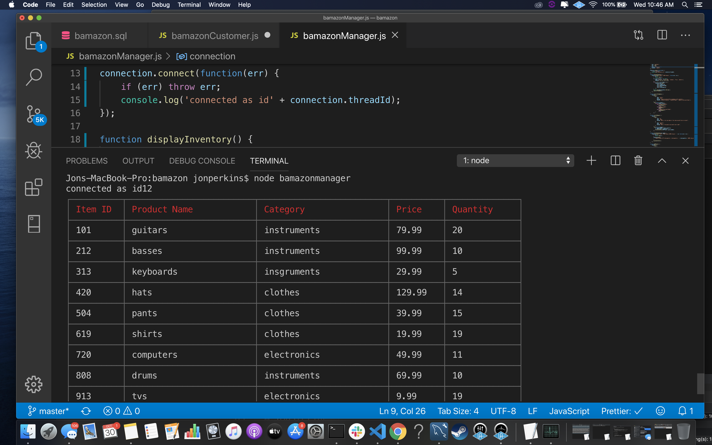
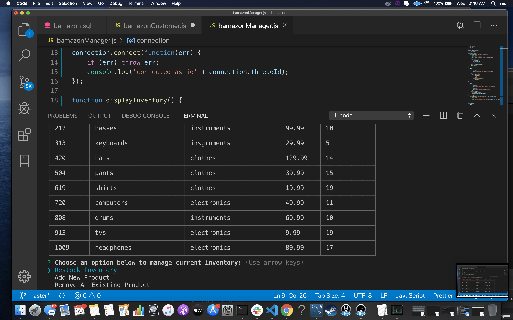
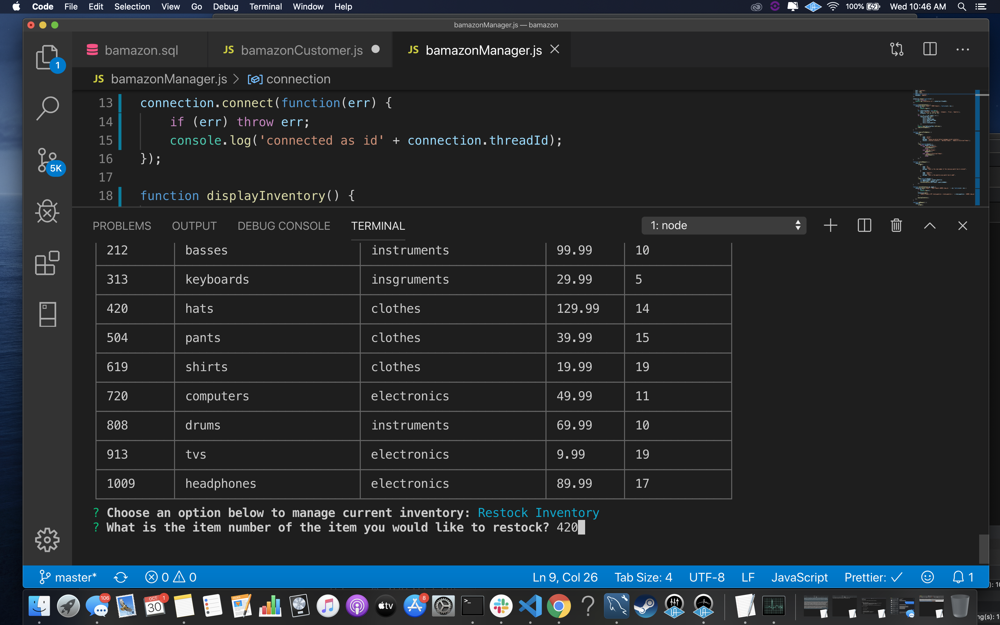
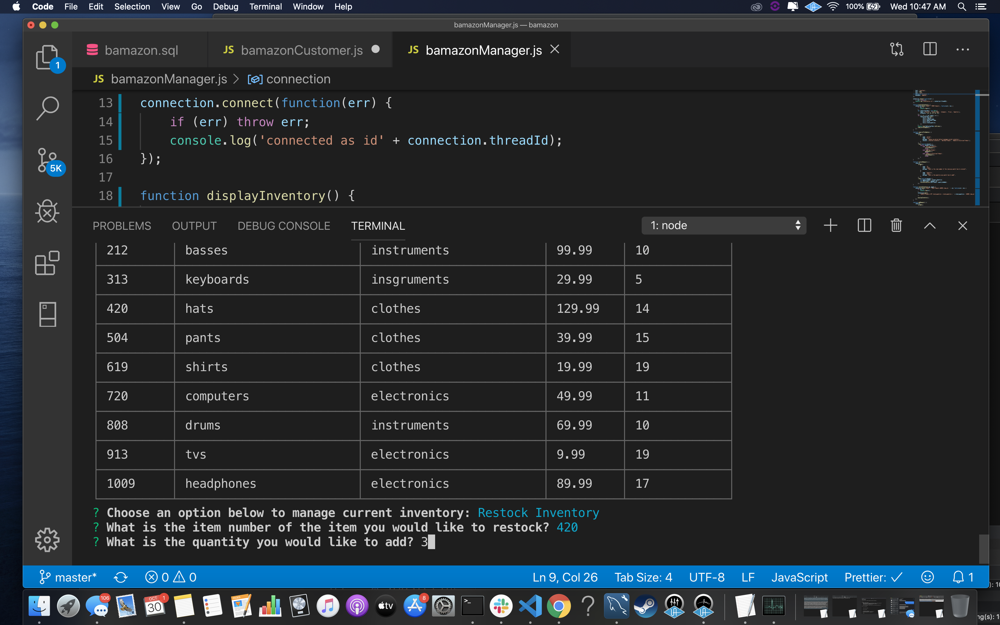
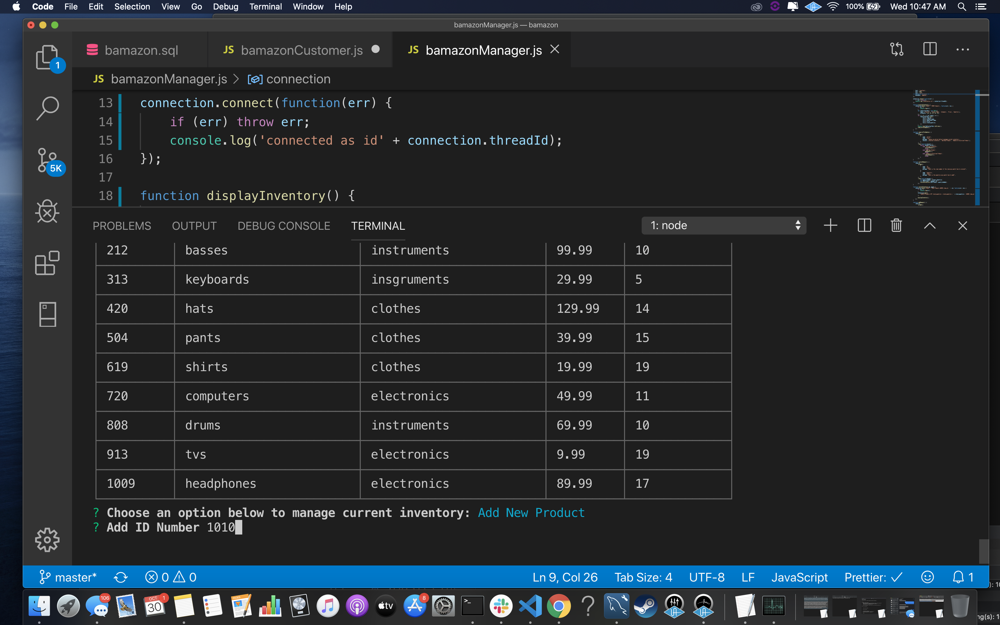
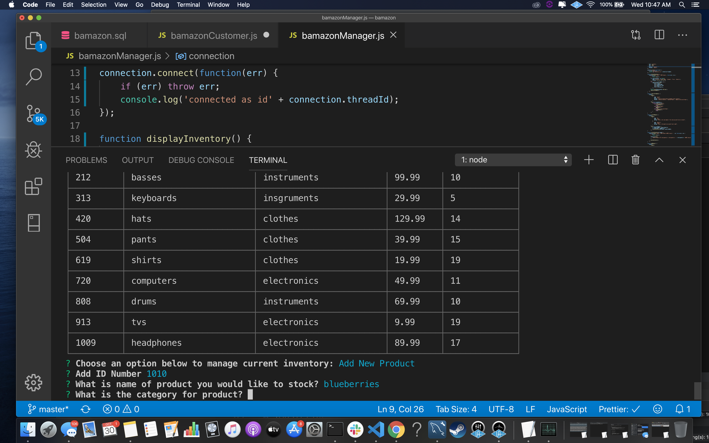
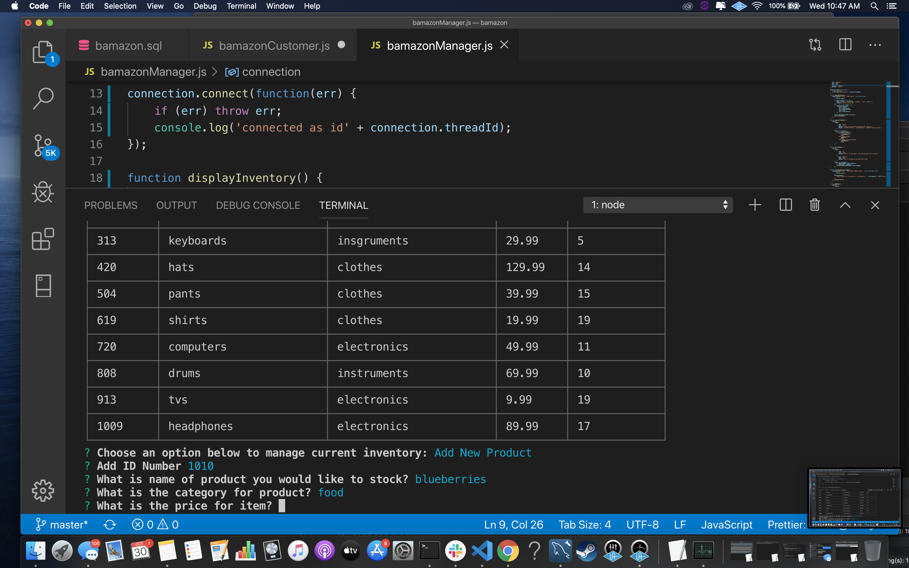
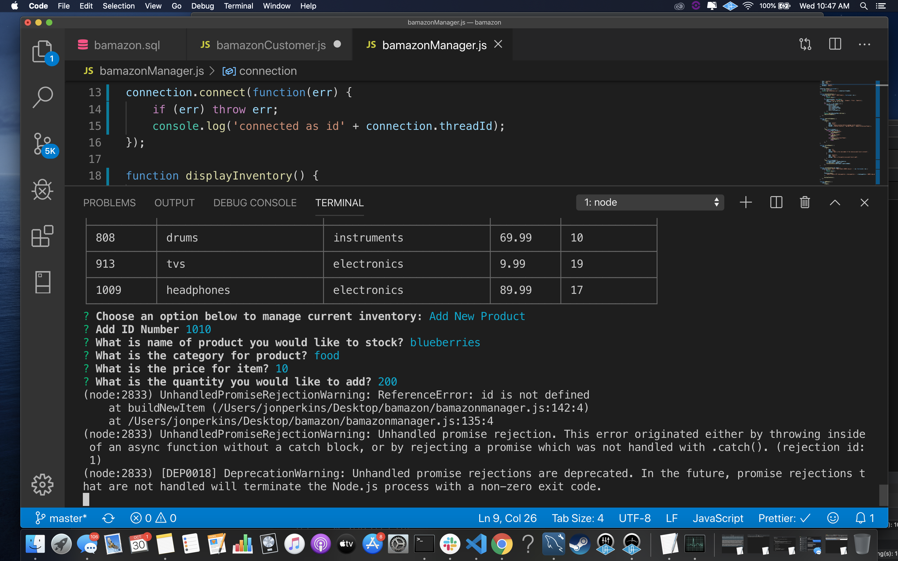
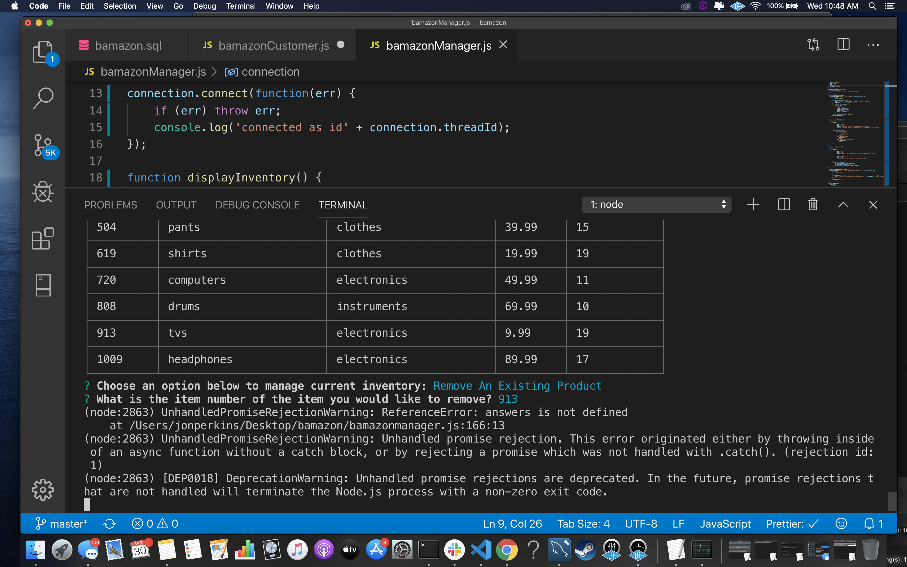
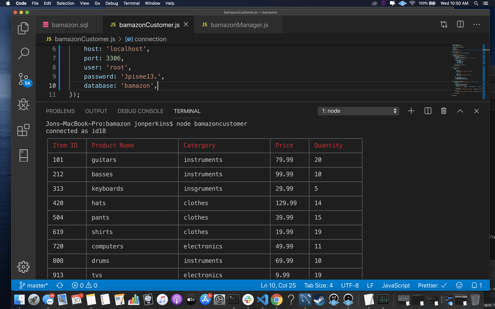
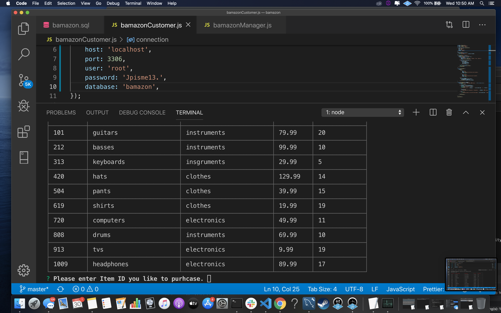
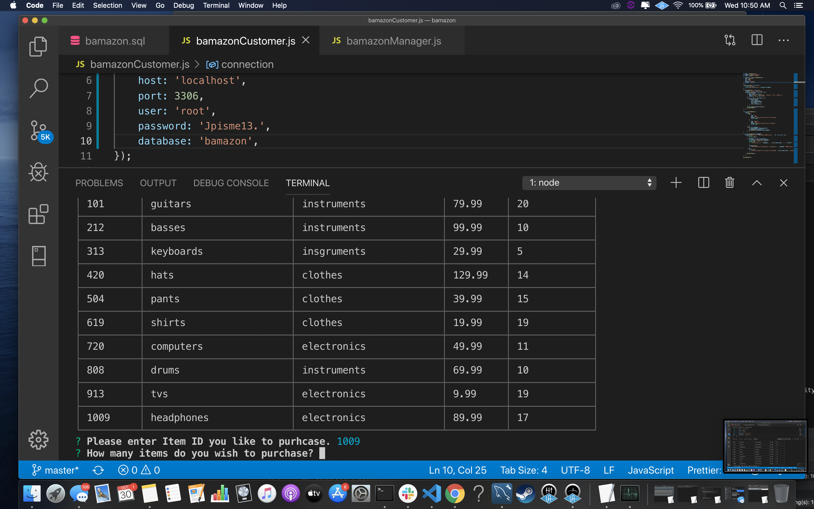
